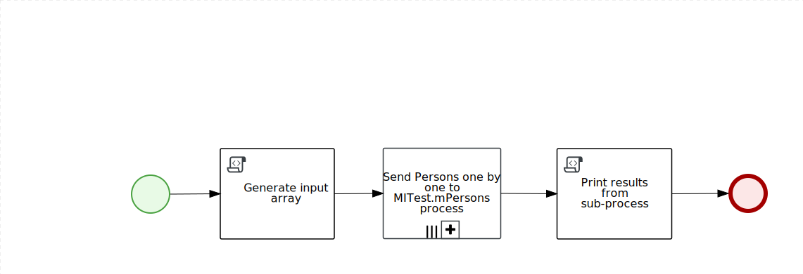

Repository to test Multiple Instance functionallity
=======================

### Run!.bpmn

* `Generate input array` task will prepare input collection for sub-process with 3 `org.myspace.mitest.Persons`.
* `Send Persons one by one to MITest.mPersons process` sub-process will send all persons one by one, get persons back with modified data (created birthdays).
* `Print results from sub-process` task will print resulting Persons to the server log.
